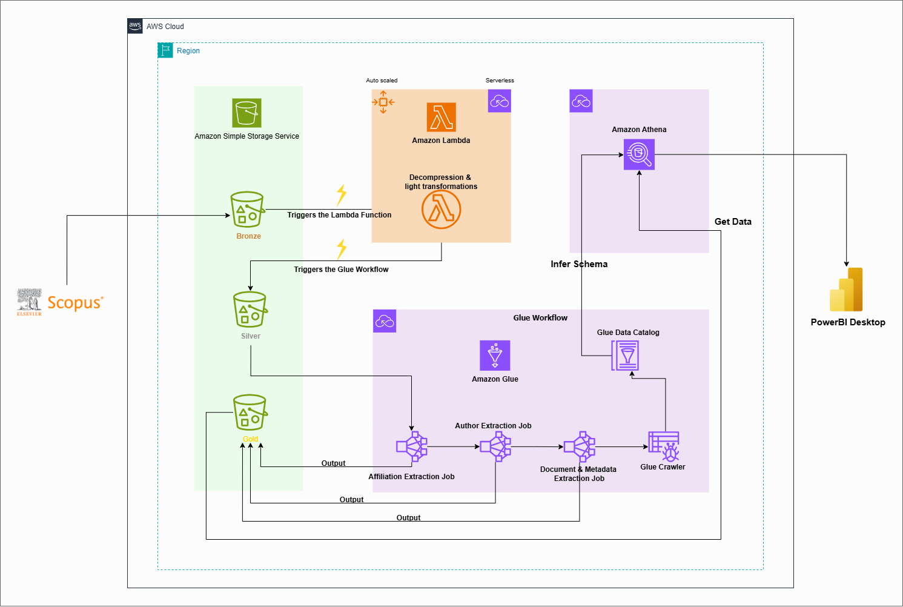
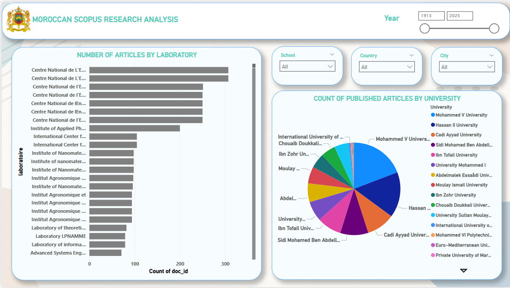
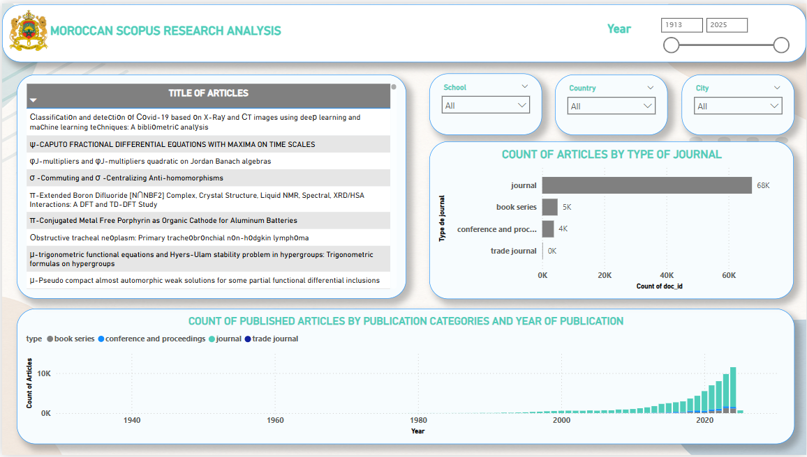
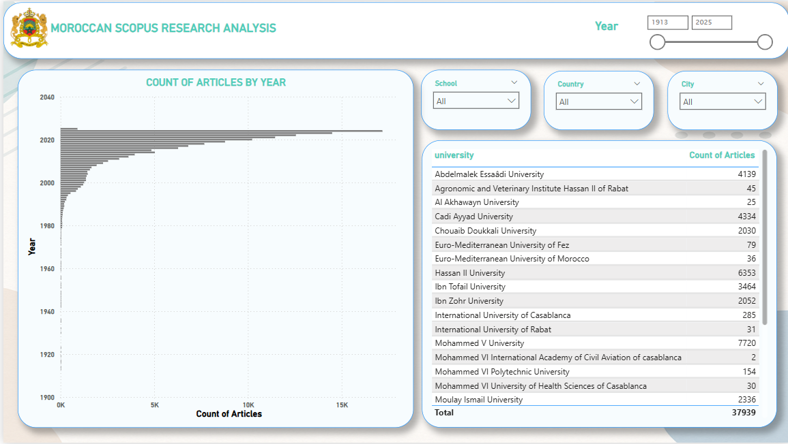

# 📊 Cloud-Based Analysis of Scientific Publications in Morocco

> An end-to-end AWS data pipeline that automatically ingests, transforms, and visualizes Moroccan scientific publications indexed on **Scopus** — enabling deep insights into research trends, institutional networks, and collaboration patterns.

---

## 🗂️ Table of Contents

- [Overview](#-overview)
- [Architecture](#-architecture)
- [Project Structure](#-project-structure)
- [Data Pipeline](#-data-pipeline)
- [Key Components](#-key-components)
- [Tech Stack](#-tech-stack)
- [Getting Started](#-getting-started)
- [Dashboard Previews](#-dashboard-previews)
- [Author](#-author)

---

## 🔭 Overview

This project automates the analysis of scientific articles authored by Moroccan researchers and indexed on [Scopus](https://www.scopus.com) — the world's largest abstract and citation database. By building a scalable cloud pipeline on AWS, it transforms raw publication exports into structured, queryable datasets powering interactive dashboards.

**What it enables:**

- Mapping collaboration networks between Moroccan and international researchers
- Identifying the most active universities, schools, and laboratories
- Tracking thematic trends and dominant research areas over time
- Comparing journal impact metrics (SJR, H-index, quartile rankings)
- Providing data-driven insights for researchers, institutions, and policymakers

---

## 🏗️ Architecture



The pipeline follows a **Bronze → Silver → Gold** medallion architecture:

| Layer  | Description |
|--------|-------------|
| **Bronze** | Raw Scopus `.zip` exports, unprocessed journal data |
| **Silver** | Pre-processed CSV files after Lambda extraction |
| **Gold**   | Structured, deduplicated dimension and fact tables |

---

## 🔄 Data Pipeline

### Stage 1 — Ingestion (Lambda)
A `.zip` file uploaded to `s3://amazon-scopus-bucket/bronze/` triggers a Lambda function that extracts and normalizes the raw CSV data into the **Silver** layer.

### Stage 2 — Transformation (AWS Glue Workflow)
four Glue jobs run sequentially via a conditional workflow:

**`AffiliationExtractionJob`**
Splits multi-valued affiliation strings, normalizes text (Unicode, punctuation), and matches each affiliation against JSON lookup maps to extract:
- University (standardized name)
- School / Faculty
- Laboratory / Research center
- City and Country
Only Morocco-based affiliations are retained. Outputs three tables: `affiliation_table`, `metadata_table`, and `intermediate_affiliation_metadata`.

**`AuthorExtractionJob`**
Parses `Author Full Names` fields (e.g. `"Smith, John (12345678)"`) to extract structured `author_name` / `author_id` pairs. Produces an `author_table` and a `row_id ↔ author_id` bridge table.

**`DocumentExtractionJob`**
Builds a clean `document_table` keyed on `doc_id` (EID stripped of its `2-s2.0-` prefix), containing title, abstract, DOI, document type, keywords, references, and bibliographic metadata.

**`JournalTransformationJob`**
Ingests raw Scimago journal rankings from the Bronze layer, cleans numeric fields (comma → decimal point), and outputs a `journal` dimension table keyed on ISSN.

**`CleaningJob`**
Final sanitization pass — strips residual quote characters and ensures output files are clean before crawling.

### Stage 3 — Cataloging (Glue Crawler)
After all jobs succeed, a Glue Crawler scans all Gold output paths and registers schema metadata in the **Glue Data Catalog**, making the tables immediately queryable via Athena.

### Stage 4 — Visualization (Athena + Power BI)
Power BI Desktop connects to Athena via ODBC in **Direct Query** mode — no data import needed. Dashboards query live data from the Gold layer.

---

## 🧩 Key Components

### Affiliation Standardization
The project ships three JSON lookup files used during Glue processing:

- **`city.json`** — ~90 Moroccan cities with spelling variants (French, Arabic transliteration, common abbreviations)
- **`school.json`** — ~130 schools/faculties mapped to their parent university and city, with acronym and French/English name variants
- **`university.json`** — ~30 Moroccan universities (public, private, and specialized) with dozens of variations per entry

Matching uses normalized text comparison (lowercased, diacritic-stripped, punctuation-removed) for robust fuzzy alignment.

### Output Schema (Gold Layer)

| Table | Key Columns |
|-------|-------------|
| `affiliation_table` | `affiliate_id`, `university`, `school`, `laboratoire`, `city`, `country` |
| `author_table` | `author_id`, `author_name` |
| `document_table` | `doc_id`, `doi`, `title`, `abstract`, `document_type`, `author_keywords` |
| `metadata_table` | `doc_id`, `row_id`, `source_title`, `year`, `affiliate_ids` |
| `journal` | `sourceid`, `title`, `issn`, `sjr`, `h_index`, `sjr_best_quartile` |
| `intermediate_affiliation_metadata` | `row_id`, `affiliate_id` |
| `intermediate_author_metadata` | `row_id`, `author_id` |

---

## 🛠️ Tech Stack

| Layer | Technology |
|-------|------------|
| Cloud | AWS (S3, Lambda, Glue, Athena) |
| IaC | Terraform |
| Processing | Apache Spark (PySpark), Python 3 |
| Querying | SQL via Amazon Athena |
| Visualization | Power BI Desktop (Direct Query via ODBC) |
| Data Source | Scopus (CSV export) |

---

## 🚀 Getting Started

### Prerequisites

- AWS account with appropriate permissions
- [Terraform](https://developer.hashicorp.com/terraform/install) 1.0+
- [AWS CLI](https://docs.aws.amazon.com/cli/latest/userguide/install-cliv2.html) configured
- Scopus account (to export publication data)
- Power BI Desktop + [Athena ODBC driver](https://docs.aws.amazon.com/athena/latest/ug/odbc-v2-driver.html)

### Deployment

```bash
# 1. Clone the repository
git clone https://github.com/AchrafElboumashouli/scopus-data-engineering-project.git
cd A-Cloud-Based-Analysis-of-Scientific-Publications-in-Morocco-Using-AWS-

# 2. Configure AWS credentials
aws configure

# 3. Initialize and deploy infrastructure
cd terraform
terraform init
terraform plan -out=plan.tfplan
terraform apply plan.tfplan
```

This provisions: the S3 bucket (with Bronze/Silver/Gold folders), all Glue jobs and their workflow, Lambda function with S3 trigger, IAM role and policies, and the Glue crawler.

### Running the Pipeline

1. Export your Scopus data as a `.csv` inside a `.zip` archive
2. Upload the `.zip` to `s3://Amazon-scopus-bucket/bronze/` — Lambda triggers automatically
3. Once Silver data is ready, manually trigger the `scopus_workflow` in AWS Glue (or set a scheduled trigger)
4. After the workflow completes, the Glue Crawler registers the Gold tables in the Data Catalog
5. Open Power BI, connect to Athena via ODBC, and start exploring

### Connecting Power BI to Athena

Follow the [AWS ODBC v2 setup guide](https://docs.aws.amazon.com/athena/latest/ug/odbc-v2-driver.html), then in Power BI:

1. Get Data → ODBC → select your Athena DSN
2. Choose **Direct Query** mode
3. Select tables from `scopus_database`

---

## 📊 Dashboard Previews
<p align="center">
  
  
  
</p>
<p align="center">
  
  
  
</p>
<p align="center">
  
</p>

---

## 👤 Author

**Achraf El Boumashouli**

---

*Built with AWS Glue, Lambda, Athena, Terraform, and PySpark.*
